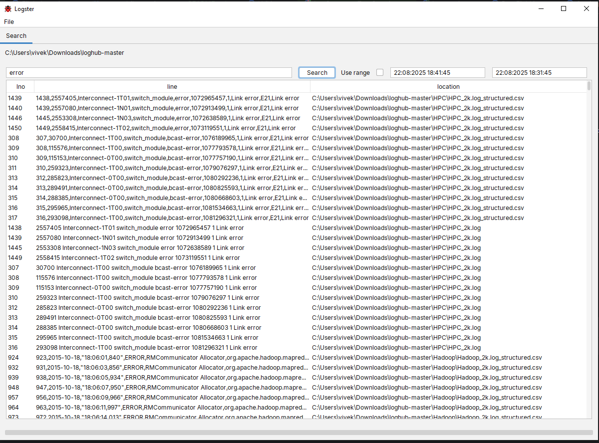
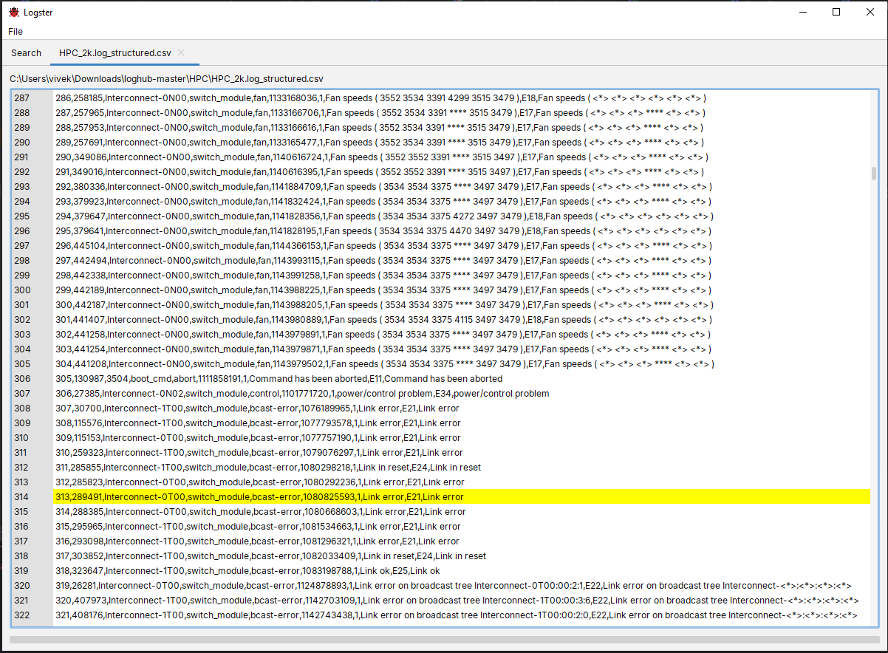

#  Logster

A desktop GUI application for searching and browsing log files.

## Motivation

Logster was inspired by tools like **glogg** and **Splunk**. The goal is
to provide a lightweight, desktop-based log viewer that can handle
multiple files while supporting timestamp-based searches.

## Features

-   Index and search log files within a selected folder
-   Search logs by timestamps
-   Define custom date/time formats
-   Add support for custom file extensions
-   View log file contents directly in the app
-   Copy log content with ease
-   Toggle log levels for better filtering

## Usage

-   **Index a folder**: Go to `File → Index Folder` and select the
    directory containing your logs
-   **Search by date range**: Enable the date range checkbox when
    searching
-   **Add custom formats/extensions**: Use `File → Settings` to add new
    file extensions and date formats
-   **Toggle log levels**: Quickly switch between different log levels
    for focused analysis

## System Requirements

- **Java Development Kit (JDK) 24** or later

## Download

You can download the latest release of Logster from the **[Releases page](../../releases/latest)**.

## Screenshots

