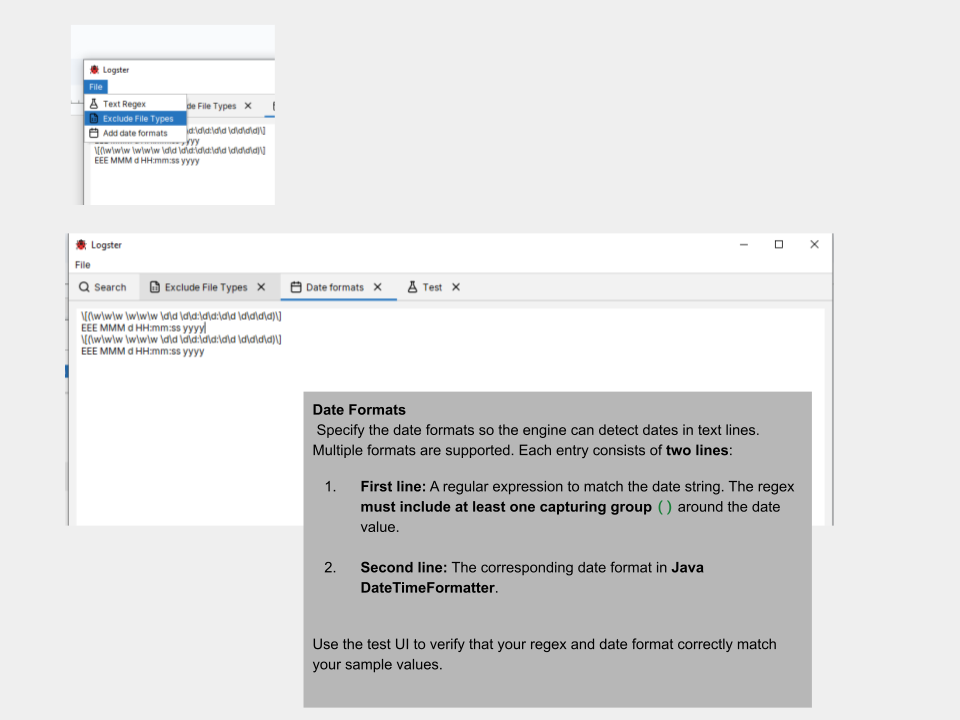
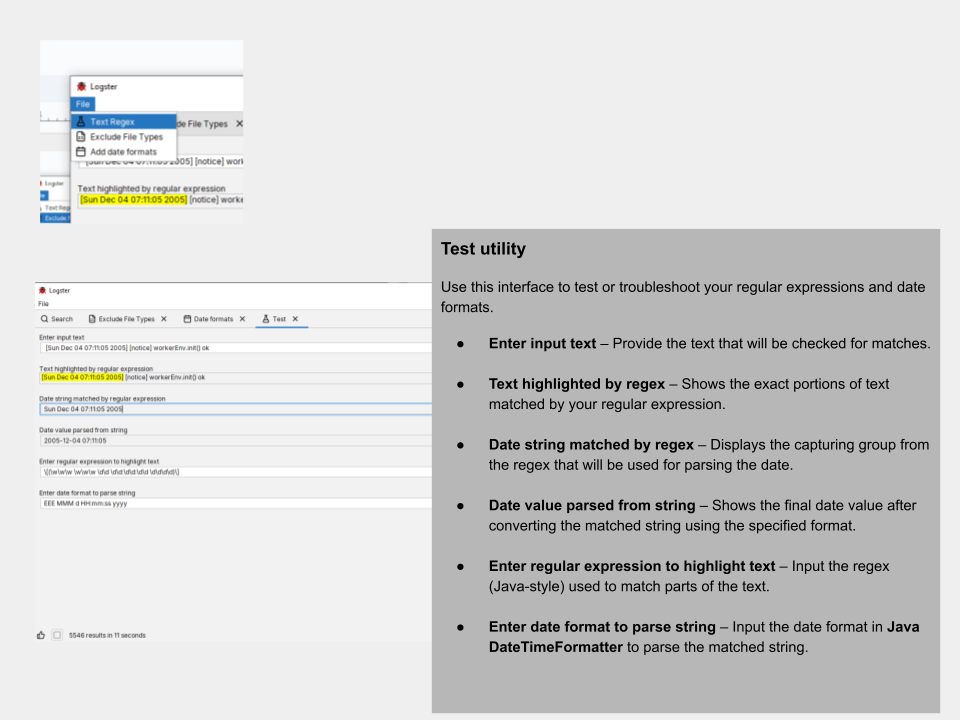

 
[![Forks][forks-shield]][forks-url]
[![Stargazers][stars-shield]][stars-url]
[![Issues][issues-shield]][issues-url]
[![MIT][license-shield]][license-url]
[![LinkedIn][linkedin-shield]][linkedin-url]


<!-- PROJECT LOGO -->
<br /> 
<div align="center">
  <a href="https://github.com/vivekg13186/logster">
    
  </a>

<h3 align="center">Logster</h3>

  <p align="center">
    A desktop GUI application for searching and browsing log files.
    <br />
    <a href="https://github.com/vivekg13186/logster/issues/new?labels=bug&template=bug-report---.md">Report Bug</a>
    &middot;
    <a href="https://github.com/vivekg13186/logster/issues/new?labels=enhancement&template=feature-request---.md">Request Feature</a>
  </p>
</div>


<!-- TABLE OF CONTENTS -->
<details>
  <summary>Table of Contents</summary>
  <ol>
    <li>
      <a href="#about-the-project">About The Project</a>
    </li>
    <li>
      <a href="#getting-started">Getting Started</a>
      <ul>
        <li><a href="#prerequisites">Prerequisites</a></li>
        <li><a href="#installation">Installation</a></li>
      </ul>
    </li>
    <li><a href="#usage">Usage</a></li>
    <li><a href="#license">License</a></li>
  </ol>
</details>


<!-- ABOUT THE PROJECT -->
## About The Project


Logster is a lightweight, desktop-based log viewer inspired by tools like glogg and Splunk. It’s designed for developers, system administrators, and IT professionals who need to efficiently manage, search, and analyze multiple log files.

Features

 - Index & Search: Quickly index and search log files within a selected folder. 
 - Timestamp-Based Searches: Filter logs using precise timestamps.
 - Custom Date/Time Formats: Adapt Logster to any log format.
 - Custom File Extensions: Work with a wide variety of log file types.
 - In-App Viewing: View log contents directly without opening external editors.
 - Easy Copying: Copy log entries with a single click.
 - Log Level Filtering: Toggle log levels for focused analysis.

Why Logster?

Logster combines speed, simplicity, and flexibility. It’s perfect for anyone who deals with large or multiple log files and needs a fast, reliable way to find and analyze log data—all from a single, user-friendly desktop application.

<p align="right">(<a href="#readme-top">back to top</a>)</p>


<!-- GETTING STARTED -->
## Getting Started

### Prerequisites

 Need java version 24 or above installed

### Installation

 You can download the latest release of Logster from the **[Releases page](../../releases/latest)**.


<p align="right">(<a href="#readme-top">back to top</a>)</p>

<!-- USAGE EXAMPLES -->
## Usage

### Search UI


Status icons

| Icon                                                     | Description                                                   | 
|----------------------------------------------------------|---------------------------------------------------------------|
|  | Searching files                                               |  
|    | Search completed                                              |
|          | The search ended because it reached the maximum result limit. | 
|        | Search cancelled                                              | 
  

 

### Excluding file types from search

Exclude File Types
Files with the specified extensions will be skipped during the search. Note that Logster automatically detects and ignores binary files.
You can provide multiple extensions as a comma-separated list.


### Search in Date Range

To scan for dates, you must define the date formats so the engine can extract the values from text.

Specify the date formats to enable the engine to recognize dates in text lines. Multiple formats are supported. Each entry should have two lines:

First line: A regular expression to match the date string. The regex must include at least one capturing group () around the date value.

Second line: The corresponding date format in Java’s [DateTimeFormatter](https://docs.oracle.com/javase/8/docs/api/java/time/format/DateTimeFormatter.html)

Use the test UI to ensure that your regex and date format correctly match your sample values.




### Test utility



Use this interface to test or troubleshoot your regular expressions and date formats.

Enter input text – Provide the text that will be checked for matches.

Text highlighted by regex – Shows the exact portions of text matched by your regular expression.

Date string matched by regex – Displays the capturing group from the regex that will be used for parsing the date.

Date value parsed from string – Shows the final date value after converting the matched string using the specified format.

Enter regular expression to highlight text – Input the regex (Java-style) used to match parts of the text.

Enter date format to parse string – Input the date format in Java’s [DateTimeFormatter](https://docs.oracle.com/javase/8/docs/api/java/time/format/DateTimeFormatter.html) to parse the matched string.

### File viewer

File Viewer
For large files, the viewer is limited to approximately ±2000 lines. Additionally, each line displays only the first 500 characters.


### Search limit

By default, the search returns a maximum of 10,000 results.
You can increase this limit by modifying the command file (.bat or .sh) as shown below:
```bash 
java -cp "logster.jar;lib/*" com.logster.Logster -dMAX_RESULT=200000
```


<p align="right">(<a href="#readme-top">back to top</a>)</p>


<!-- LICENSE -->
## License

Distributed under the MIT License. See `MIT License` for more information.

<p align="right">(<a href="#readme-top">back to top</a>)</p>


<!-- MARKDOWN LINKS & IMAGES -->
<!-- https://www.markdownguide.org/basic-syntax/#reference-style-links -->
[forks-shield]: https://img.shields.io/github/forks/vivekg13186/logster.svg?style=for-the-badge
[forks-url]: https://github.com/vivekg13186/logster/network/members
[stars-shield]: https://img.shields.io/github/stars/vivekg13186/logster.svg?style=for-the-badge
[stars-url]: https://github.com/vivekg13186/logster/stargazers
[issues-shield]: https://img.shields.io/github/issues/vivekg13186/logster.svg?style=for-the-badge
[issues-url]: https://github.com/vivekg13186/logster/issues
[license-shield]: https://img.shields.io/github/license/vivekg13186/logster.svg?style=for-the-badge
[license-url]: https://github.com/vivekg13186/logster/blob/master/LICENSE.txt
[linkedin-shield]: https://img.shields.io/badge/-LinkedIn-black.svg?style=for-the-badge&logo=linkedin&colorB=555
[linkedin-url]: https://www.linkedin.com/in/vivek-gangadharan-4b836816
 
 